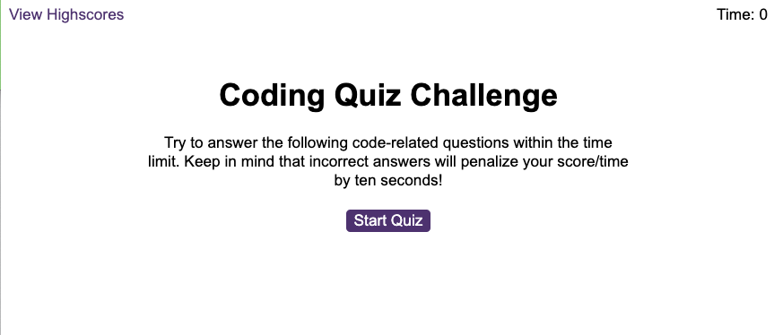
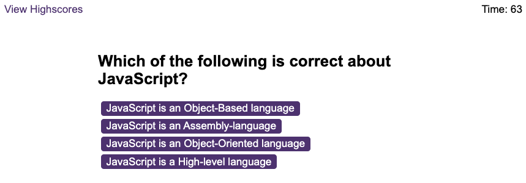
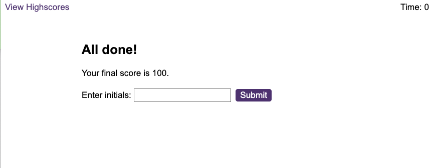

# JavaScript Fundermentals Quiz

## Description
This repository holds the source files for a timed JavaScript fundermentals quiz app. The app features questions on JavaScript topics and multiple choice answers. It also stores high scores to local storage which can be cleared if the user chooses. The app runs in a browser and features dynamically updated HTML and CSS powered by JavaScript. It has a clean and polished user interface that is responsive.

## Tecnologies Used
* HTML
* CSS
* JavaScript

## Live Application
https://ladykays.github.io/javascript-fundermentals-quiz

## Screenshots

## Credits
* https://www.youtube.com/watch?v=riDzcEQbX6k&t=27s
* https://www.youtube.com/watch?v=LQGTb112N_c
* https://www.youtube.com/watch?v=Tf9hr4tmhK4
* https://www.sitepoint.com/simple-javascript-quiz/
* https://www.youtube.com/watch?v=DFhmNLKwwGw
* https://www.youtube.com/watch?v=IlnZxLeQezI
* https://www.sanfoundry.com/1000-javascript-questions-answers/
* https://www.w3schools.com/js/js_quiz.asp

## Licence
Please refer to LICENCE in the repository
